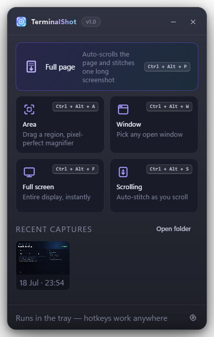
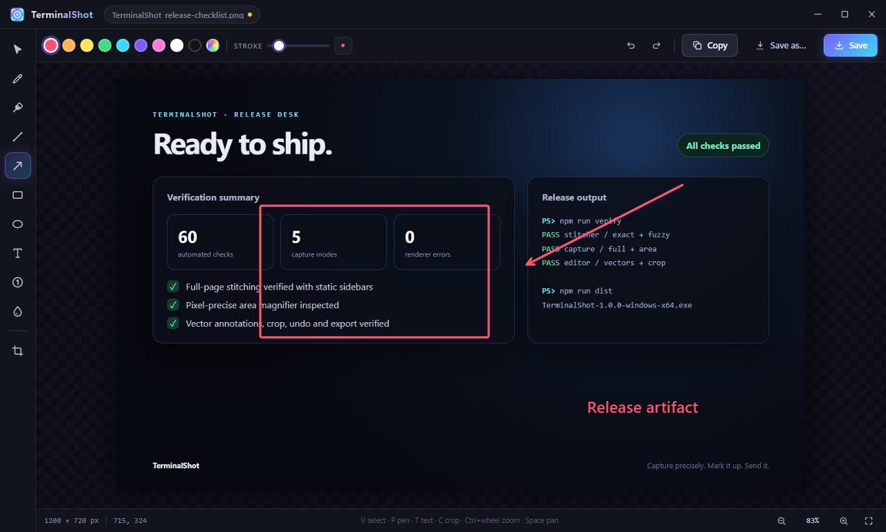

<div align="center">
  
  <h1>TerminalShot</h1>
  <p><strong>Capture precisely. Mark it up. Send it.</strong></p>
  <p>A fast, tray-resident screenshot studio for Windows.</p>

  [](#download)
  [](LICENSE)
  [](https://github.com/crossps/TerminalShot/releases/latest)
</div>



TerminalShot handles the whole screenshot handoff: capture a display, window, precise region, or scrolling page; make the point in a vector editor; then copy, save, or drag the finished PNG straight into another app. It stays in the tray until a global hotkey calls it.

No account. No telemetry. No cloud upload. Captures and settings stay on your PC.

## Why TerminalShot

- **Full-page capture that follows the page.** Pick the scrolling content once. TerminalShot rewinds it, learns the target application's scroll step, captures continuously, and stitches the result.
- **Pixel-precise area selection.** The screen freezes before selection. A live loupe shows an 11×11 magnification, crosshair, coordinates, and hex color.
- **A handoff instead of a file hunt.** Every capture appears as a floating card. Drag the real PNG into Explorer, Discord, an issue, or a browser—or open it directly in the editor.
- **Annotations remain editable.** Arrows, shapes, text, highlighter, step markers, pixelation, and crop stay as vector objects until export.
- **Built for real desktop layouts.** The scroll stitcher isolates changing columns, tolerates sticky headers and static sidebars, and has a fuzzy path for streamed YUV frames.

## Capture modes

| Mode | Default hotkey | What it does |
|---|---:|---|
| Full page | `Ctrl` + `Alt` + `P` | Select content once; TerminalShot rewinds, scrolls, and stitches it automatically. |
| Area | `Ctrl` + `Alt` + `A` | Freeze the display and drag a pixel-precise region with a magnifier. |
| Window | `Ctrl` + `Alt` + `W` | Choose any open window from a visual picker. |
| Full screen | `Ctrl` + `Alt` + `F` | Capture the display under the pointer immediately. |
| Scrolling | `Ctrl` + `Alt` + `S` | Mark a region, scroll it yourself, and let TerminalShot stitch the new rows. |

## The editor



Use `V` Select, `P` Pen, `H` Highlighter, `L` Line, `A` Arrow, `R` Rectangle, `E` Ellipse, `T` Text, `S` Step marker, `B` Pixelate, and `C` Crop. Objects can be moved, resized, recolored, and undone. Hold `Shift` for squares, circles, and 45-degree lines; use `Ctrl` + mouse wheel to zoom and Space-drag to pan.

## Download

Download the latest portable Windows build from [Releases](https://github.com/crossps/TerminalShot/releases/latest) and run the `TerminalShot-*-windows-x64.exe` asset; no installer is required. Windows may show a SmartScreen notice because community builds are not code-signed.

TerminalShot targets Windows 10/11 x64.

## Run from source

Requires Node.js 18 or newer.

```powershell
git clone https://github.com/crossps/TerminalShot.git
cd TerminalShot
npm ci
npm start
```

Build the portable executable with:

```powershell
npm run dist
```

## Verification

```powershell
npm test         # deterministic scroll-stitcher tests
npm run verify   # full Electron UI and capture verification
```

The full verifier launches the real app, exercises every capture surface and the annotation editor, and fails on renderer errors. Test settings and captures are isolated from normal user data.

## Privacy and storage

TerminalShot does not send capture data anywhere. Settings are stored as JSON under the current user's application-data directory, and screenshots default to `Pictures\TerminalShot`. Both locations remain under your control.

Automatic full-page capture posts `WM_MOUSEWHEEL` messages to the selected window only. It does not use system-wide input injection. Elevated windows can reject those messages under Windows UIPI; manual scrolling capture remains available in that case.

## Limits

- Manual scrolling needs overlapping frames; scroll steadily rather than jumping an entire viewport at once.
- Horizontal scrolling is not stitched.
- Infinite feeds stop after repeated frames without progress.
- Automatic scrolling cannot control an elevated window from a non-elevated TerminalShot process.

## Contributing

Bug reports and focused pull requests are welcome. Start with [CONTRIBUTING.md](CONTRIBUTING.md), and use [SECURITY.md](SECURITY.md) for sensitive reports.

TerminalShot is part of the same Windows-tool line as [TerminalApp](https://github.com/crossps/TerminalApp), a tiled console for coding agents.

## License

[MIT](LICENSE) © 2026 crossps
